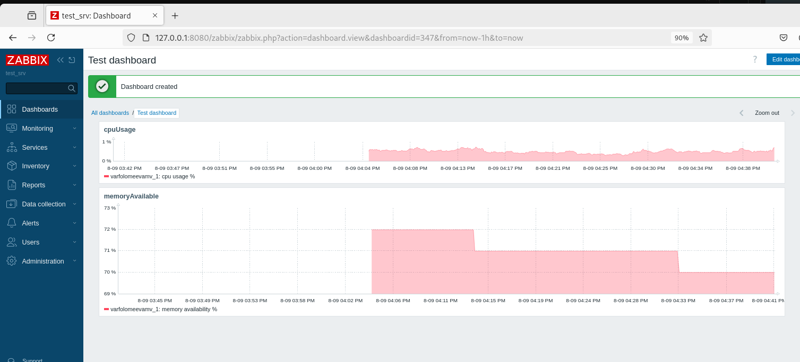

# Домашнее задание к занятию "Система мониторинга Zabbix. Часть 2" - Варфоломеева Марьяна

### Задание 1
В веб-интерфейсе Zabbix Servera в разделе Templates создать шаблон, который  будет собирать информацию о загрузке CPU 
в процентах и загрузке RAM в процентах:

### Задание 2-3

latest_data для 2 хостов с шаблоном из задания №11:

### Задание 4

